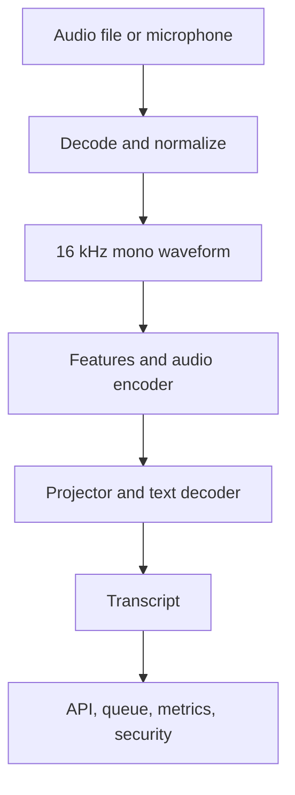
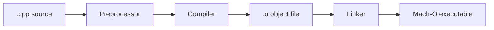
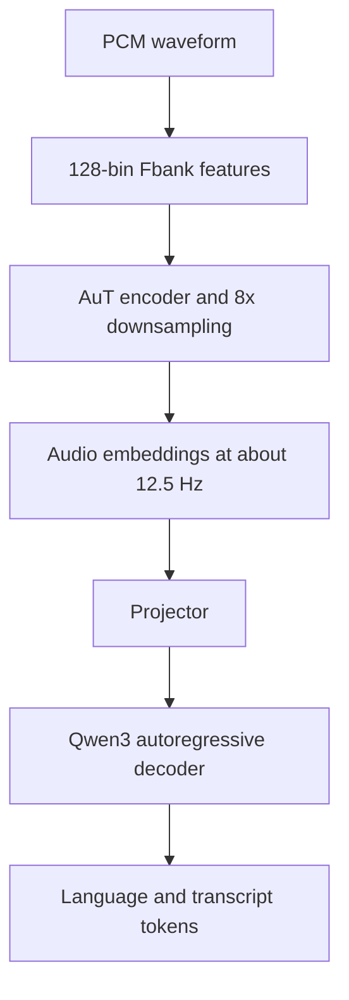

# Qwen3-ASR Lab — Week 1 Foundation and Review

This repository is a four-month, interview-focused engineering project with two goals:

1. Build a production-minded, local automatic speech recognition (ASR) service.
2. Prepare for C++, ML systems, system design, DSA, debugging, and behavioral interviews at companies such as Datadog, Hugging Face, Mistral, Google, and NVIDIA in Paris.

Week 1 is about foundations. It is not about pretending we trained Qwen3-ASR. It is about understanding how C++ becomes an executable, how reusable code is organized, how `llama.cpp` runs model weights, how audio reaches an ASR model, and how to collect trustworthy evidence.

---

## Current status

### Verified

- Development machine: MacBook Air `Mac16,12`, Apple M4, 10 CPU cores, 24 GB unified memory, Metal 4.
- Native architecture: `arm64`.
- `audio_math` output:

  ```text
  sample_rate=16000
  sample_count=16000
  duration_seconds=1
  rms=0.353553
  ```

- `audio_math` is a native ARM64 Mach-O executable.
- Personal GitHub authentication and repository remote work:

  ```text
  git@github-personal:architjen/qwen3-asr-lab.git
  ```

- Repository Git identity:

  ```text
  Archit Jain <architjen010@gmail.com>
  ```

- Initial commit:

  ```text
  0c99f04 Set up native C++ ASR development environment
  ```

### Reported complete, but evidence still belongs in this repository

- Day 2 library, executable, unit-test, and sanitizer builds.
- Day 3 CPU and Metal `llama.cpp` builds.

### Still required to close Week 1

- [ ] Save `ctest` output from the normal and sanitized builds.
- [ ] Record the exact `llama.cpp` commit and CMake settings.
- [ ] Validate one synthetic WAV with `ffprobe`.
- [ ] Obtain one CPU Qwen3-ASR transcript.
- [ ] Obtain one Metal Qwen3-ASR transcript and prove Metal was used.
- [ ] Record one real microphone sample and transcribe it.
- [ ] Run one warm-up plus three measured CPU and Metal runs.
- [ ] Calculate median latency and real-time factor (RTF).
- [ ] Implement and test the Week 1 sliding-window DSA exercise.
- [ ] Write the small ASR API design.
- [ ] Pass the explanation-without-notes check.

Do not start Week 2 until the required evidence exists. Reading this document is revision; producing and explaining the outputs is completion.

---

## 1. The entire project in one picture



Week 1 touches both ends:

- At the low level, we compile C++, inspect memory-safe behavior, and understand samples.
- At the model level, we build an inference runtime and execute an existing pretrained model.
- At the systems level, we begin measuring latency, memory, reproducibility, and failure behavior.

Later weeks will fill in the middle: WAV parsing, resampling, log-Mel features, tensor shapes, the audio encoder, transformer decoding, KV caching, quantization, streaming, serving, observability, deployment, and evaluation.

---

## 2. The four things that must never be confused

| Thing | Example | What it is | What it is not |
|---|---|---|---|
| Source code | `src/audio_math.cpp` | Human-readable C++ instructions | A runnable program |
| Build configuration | `CMakeLists.txt` | Description of targets and their relationships | A compiler or executable |
| Executable | `build-debug/audio_math` or `llama-mtmd-cli` | Native machine code macOS can run | Learned model knowledge |
| Model weights | Qwen3-ASR Q8 GGUF files | Learned numeric parameters and metadata | The program that executes them |

An executable is like a music player. The GGUF weights are like the recording. The player knows how to interpret the file; the file contains the learned content.

---

## 3. How C++ becomes a program



### Preprocessing

The preprocessor expands directives such as `#include "audio_math.h"`. Conceptually, declarations from the included header become visible to that translation unit.

### Compilation

Clang checks syntax and types, then converts each `.cpp` translation unit into object code. Compilation can succeed even if a function's implementation has not yet been found.

### Linking

The linker combines object files and libraries and resolves symbols. If `audio_demo.cpp` calls `analyze_signal` but the object code containing its implementation is not linked, the compiler may succeed and the linker will report an undefined symbol.

### Executable

The final Mach-O file contains native machine instructions for a target architecture such as ARM64. macOS can load and execute it.

### Python analogy

| C++ concept | Rough Python analogy | Important difference |
|---|---|---|
| Header declaration | Function signature/type stub in a `.pyi` file | C++ needs declarations during compilation |
| `.cpp` implementation | Function body in a `.py` module | C++ is compiled before normal execution |
| Static library | Reusable installed module/package | Library machine code is linked into consumers |
| Executable | `python -m my_app` entry point | C++ executable contains native code |
| CMake configure | Reading `pyproject.toml` and preparing a build | CMake generates another build system |
| Ninja build | A very fast build executor | It invokes Clang only for work that is needed |
| Linker | Import resolution is only a loose analogy | Linking happens before the executable runs |

Python comparisons are learning aids, not exact equivalences.

---

## 4. Headers, source files, libraries, and executables

### `.h` versus `.cpp`

A header normally describes the public contract:

```cpp
// include/audio_math.h
#pragma once

#include <cstddef>
#include <vector>

namespace asr {

struct SignalStats {
    std::size_t sample_count;
    double duration_seconds;
    double rms;
};

SignalStats analyze_signal(
    const std::vector<float>& samples,
    int sample_rate
);

}  // namespace asr
```

The source file provides the implementation:

```cpp
// src/audio_math.cpp
#include "audio_math.h"

#include <cmath>
#include <stdexcept>

namespace asr {

SignalStats analyze_signal(
    const std::vector<float>& samples,
    int sample_rate
) {
    if (samples.empty()) {
        throw std::invalid_argument("samples must not be empty");
    }
    if (sample_rate <= 0) {
        throw std::invalid_argument("sample_rate must be positive");
    }

    double sum_of_squares = 0.0;
    for (float value : samples) {
        const double sample = static_cast<double>(value);
        sum_of_squares += sample * sample;
    }

    return {
        samples.size(),
        static_cast<double>(samples.size()) / sample_rate,
        std::sqrt(sum_of_squares / samples.size())
    };
}

}  // namespace asr
```

The header answers, “What may callers use?” The `.cpp` file answers, “How is it done?”

### Why there are several `audio_math` names

| Name | Kind | Purpose |
|---|---|---|
| `include/audio_math.h` | Header | Declares the public API |
| `src/audio_math.cpp` | Source | Implements the API |
| `audio_math_lib` | CMake library target | Compiles and packages the reusable implementation |
| `audio_math` | Executable target | Generates a signal and demonstrates the library |
| `audio_math_test` | Test executable | Calls the same library and checks expected behavior |

Names can be similar because they refer to different layers. CMake target names are logical names, not necessarily source filenames.

### Why the library exists

Both a demonstration program and a test need signal analysis:

```text
audio_demo.cpp  ----\
                     >---- audio_math_lib ---- audio_math.cpp
audio_math_test.cpp-/
```

Without the library, the calculation would be copied into both programs. Duplication creates two sources of truth, duplicated bugs, and tests that might accidentally test different code from production.

### The key CMake relationships

```cmake
cmake_minimum_required(VERSION 3.20)
project(qwen3_asr_lab LANGUAGES CXX)

set(CMAKE_CXX_STANDARD 20)
set(CMAKE_CXX_STANDARD_REQUIRED ON)
set(CMAKE_CXX_EXTENSIONS OFF)

add_library(audio_math_lib STATIC
    src/audio_math.cpp
)

target_include_directories(audio_math_lib PUBLIC
    ${CMAKE_CURRENT_SOURCE_DIR}/include
)

add_executable(audio_math
    src/audio_demo.cpp
)

target_link_libraries(audio_math PRIVATE
    audio_math_lib
)

add_executable(audio_math_test
    tests/audio_math_test.cpp
)

target_link_libraries(audio_math_test PRIVATE
    audio_math_lib
)

enable_testing()
add_test(NAME audio_math_test COMMAND audio_math_test)
```

Read the verbs literally:

- `add_library`: create a reusable build target.
- `target_include_directories`: tell consumers where public headers live.
- `add_executable`: create a runnable target.
- `target_link_libraries`: connect the caller to the compiled implementation it uses.
- `add_test`: register a runnable check with CTest.

The official CMake tutorial uses the same `add_library` and `target_link_libraries` relationship: [CMake — Adding a Library](https://cmake.org/cmake/help/latest/guide/tutorial/Adding%20a%20Library.html).

---

## 5. What CMake actually does

CMake is a build-system generator and project-configuration language.

When you run:

```bash
cmake -S . -B build-debug -G Ninja -DCMAKE_BUILD_TYPE=Debug
```

you are saying:

- `-S .`: source tree and `CMakeLists.txt` are in the current directory.
- `-B build-debug`: place generated build files in `build-debug`.
- `-G Ninja`: generate instructions for Ninja.
- `-DCMAKE_BUILD_TYPE=Debug`: configure an unoptimized, debuggable build.

This step normally does not compile all C++ files. It detects tools, evaluates `CMakeLists.txt`, resolves target relationships, and writes Ninja rules plus a `CMakeCache.txt`.

When you run:

```bash
cmake --build build-debug
```

CMake delegates to the generated build tool. Ninja determines what changed, invokes Clang for the required `.cpp` files, and invokes the linker for affected libraries and executables.

When you run:

```bash
ctest --test-dir build-debug --output-on-failure
```

CTest runs tests registered by `add_test`.

### Why use CMake instead of one long `clang++` command?

A one-file manual command is educational. A production project has many source files, libraries, tests, compile flags, platforms, and external dependencies. CMake keeps those relationships in version-controlled configuration and can generate builds for Ninja, Xcode, Make, and other tools.

---

## 6. Directory meanings

| Directory | Owned by | Contents | Commit it? |
|---|---|---|---|
| `src/` | Us | Private implementations and application entry points | Yes |
| `include/` | Us | Public headers/contracts | Yes |
| `tests/` | Us | Automated checks | Yes |
| `notes/` | Us | Weekly explanations and design notes | Yes |
| `runs/` | Us | Benchmark summaries; raw logs may be ignored | Usually CSV/summary only |
| `third_party/` | External project | `llama.cpp` source | Usually ignored or pinned as a submodule later |
| `build-debug/` | Tools | Generated Debug objects, libraries, executables, cache | No |
| `build-sanitized/` | Tools | Generated instrumented Debug build | No |
| `build-metal/` | Tools | Release `llama.cpp` build with Metal capability | No |
| `build-cpu/` | Tools | Release `llama.cpp` build with Metal disabled | No |

Source directories are inputs. Build directories are disposable outputs. You should be able to delete a build directory and recreate it from source plus documented commands.

---

## 7. Debug, sanitized, and Release builds

| Build | Optimization | Debug symbols | Extra checks | Use |
|---|---:|---:|---:|---|
| Debug | Low/none | Yes | Normal runtime checks only | LLDB and correctness work |
| Sanitized | Low/none | Yes | ASan/UBSan instrumentation | Memory and undefined-behavior bugs |
| Release | High | Often limited | Normally none | Performance measurement and deployment |

Never benchmark a Debug or sanitizer build as if it represented production performance.

### What sanitizers are

Sanitizers modify the compiled program and add runtime support so invalid behavior can be detected while the relevant code executes.

- AddressSanitizer (ASan) detects problems such as out-of-bounds memory access, use-after-free, and double-free.
- UndefinedBehaviorSanitizer (UBSan) detects selected forms of undefined behavior such as invalid shifts, some integer overflows, and misaligned access.

ASan is not merely a test runner, and CMake is not the sanitizer. CMake applies the required compiler and linker flags consistently to the relevant targets. Clang instruments the code; the sanitizer runtime reports failures. Clang documents that AddressSanitizer adds both compiler instrumentation and a runtime library: [Clang AddressSanitizer](https://clang.llvm.org/docs/AddressSanitizer.html).

### Why test both normal and sanitized builds

- The normal Debug build is faster and comfortable for LLDB.
- The sanitized build reveals classes of bugs ordinary tests may miss.
- Passing sanitizers does not prove there are no bugs; it means no enabled sanitizer detected a problem on the executed paths.

---

## 8. LLDB and `.dSYM`

LLDB pauses a running program so you can inspect actual program state.

```bash
lldb ./build-debug/audio_math
```

Useful commands:

```text
breakpoint set --name main
run
next
step
frame variable
frame variable i
bt
continue
quit
```

| Command | Meaning |
|---|---|
| `breakpoint set` | Choose where execution should pause |
| `run` | Start the program under the debugger |
| `next` | Execute the next source line without entering called functions |
| `step` | Execute the next source line and enter a called function |
| `frame variable` | Show local variables in the current stack frame |
| `bt` | Print the call stack/backtrace |
| `continue` | Resume until exit or another breakpoint |

On macOS, `audio_math.dSYM` is a debug-symbol bundle. It maps optimized/native addresses back to function names, source files, line numbers, and variables. It is not another executable and does not run by itself. Release artifacts sent to users may be stripped while symbols are retained separately for crash analysis.

---

## 9. C++ concepts used in `audio_math`

### `constexpr`

```cpp
constexpr int sample_rate = 16000;
```

The value is constant and can be known at compile time.

### `std::vector<float>`

```cpp
std::vector<float> samples(sample_count);
```

The vector owns a dynamically sized, contiguous array. For 16,000 typical four-byte floats, the sample storage is approximately 64,000 bytes.

Contiguous storage is useful for cache efficiency and interoperability with numerical libraries.

### `const std::vector<float>&`

- `vector<float>`: a vector of single-precision floating-point values.
- `&`: pass by reference, avoiding a full copy.
- `const`: the called function promises not to modify the vector through that reference.

### `static_cast`

```cpp
static_cast<double>(i)
```

This makes a conversion explicit. It prevents accidental integer division and makes narrowing or widening decisions visible.

### RAII

Resource Acquisition Is Initialization ties a resource's lifetime to an object's lifetime. `std::vector` acquires heap memory and releases it automatically in its destructor. RAII helps prevent leaks and forgotten cleanup for memory, files, locks, sockets, and other resources.

### Why samples are `float` but accumulation is `double`

Audio/model tensors commonly use `float` because it balances range, precision, memory, and compute cost. Summing many squared values in `double` reduces accumulated rounding error and the chance of overflow compared with a `float` accumulator.

---

## 10. Audio fundamentals

### Sample rate versus sample count

- Sample rate is samples captured per second per channel.
- Sample count is how many samples are present.
- Duration is `sample_count / sample_rate` for one channel's sample sequence.

At 16 kHz:

- One second contains 16,000 samples.
- Five seconds contain 80,000 samples.

### Mono versus stereo

- Mono has one channel.
- Stereo has two channels, commonly left and right.

At 16 kHz stereo, each second has 16,000 sample frames and 32,000 individual channel samples.

### WAV versus PCM

- WAV is a container with metadata and chunks.
- PCM is a way to represent sampled amplitudes without perceptual compression.
- `pcm_s16le` means signed, 16-bit, little-endian PCM.

A file named `.wav` is not automatically the exact codec, sample rate, channel count, or bit depth we require. Inspect it.

### Sine wave and RMS

The generated tone is:

\[
x(t)=A\sin(2\pi ft)
\]

with amplitude `A = 0.5`, frequency `f = 440 Hz`, and sample times `t = i / 16000`.

RMS is:

\[
\operatorname{RMS}(x)=\sqrt{\frac{1}{N}\sum_{i=0}^{N-1}x_i^2}
\]

For a complete sine wave:

\[
\operatorname{RMS}=\frac{A}{\sqrt{2}}=\frac{0.5}{\sqrt{2}}\approx0.353553
\]

RMS measures average signal energy more meaningfully than a simple signed mean, which is near zero for a centered waveform. Peak amplitude captures a different property: the largest instantaneous magnitude.

### Complexity

- Generating/analyzing `N` samples once: `O(N)` time.
- Storing `N` samples: `O(N)` space.
- `samples[i]`: `O(1)` indexing.
- RMS alone can be computed with `O(1)` additional space, but ASR retains waveform samples for later framing, resampling, batching, and feature extraction.

---

## 11. What `llama.cpp` is and how it relates to our project

`llama.cpp` is a C/C++ inference runtime built on GGML. It provides tensor operations, model loading, quantized execution, CPU/GPU backends, command-line tools, and an HTTP server. Apple Silicon is supported through ARM optimizations, Accelerate, and Metal. Its multimodal subsystem, `libmtmd`, supports audio inputs and exposes `llama-mtmd-cli` for development plus `llama-server` for serving. See the current [llama.cpp overview](https://github.com/ggml-org/llama.cpp), [build guide](https://github.com/ggml-org/llama.cpp/blob/master/docs/build.md), and [multimodal guide](https://github.com/ggml-org/llama.cpp/blob/master/docs/multimodal.md).

It is a third-party dependency, not the same build as our educational `audio_math` project:

| Build | Source | Output | Purpose |
|---|---|---|---|
| Our Debug build | Our `src/`, `include/`, `tests/` | `audio_math`, tests, library | Learn C++ and verify small components |
| Our sanitized build | Same source plus sanitizer flags | Instrumented targets | Find memory/UB defects |
| `llama.cpp` CPU Release | `third_party/llama.cpp` | CPU-only inference tools/libraries | Portable baseline and old Intel deployment path |
| `llama.cpp` Metal Release | Same `llama.cpp` source | Metal-capable inference tools/libraries | Accelerated M4 inference |

We use `llama.cpp` in stages:

1. Establish a known working inference baseline.
2. Trace its audio preprocessing and Qwen-specific compute graph.
3. Reimplement small educational components ourselves.
4. Integrate the mature runtime into our service instead of rewriting every kernel.
5. Measure, profile, test, deploy, and operate the complete service.

---

## 12. CPU and Metal builds

The same source can produce different binaries because CMake options select compiled capabilities.

### Record the exact third-party revision

```bash
cd "$HOME/Developer/qwen3-asr-lab/third_party/llama.cpp"
git rev-parse HEAD | tee ../../notes/llama-commit.txt
```

### Metal Release build

```bash
cmake \
  -S . \
  -B build-metal \
  -G Ninja \
  -DCMAKE_BUILD_TYPE=Release \
  -DGGML_METAL=ON

cmake --build build-metal -j 4
```

### CPU-only Release build

```bash
cmake \
  -S . \
  -B build-cpu \
  -G Ninja \
  -DCMAKE_BUILD_TYPE=Release \
  -DGGML_METAL=OFF

cmake --build build-cpu -j 4
```

Metal is currently enabled by default on macOS, but setting it explicitly documents the experiment. A CPU build with `GGML_METAL=OFF` cannot gain Metal capability from a runtime flag. A Metal-capable executable may still run work on the CPU if offload is disabled. Build capability and runtime behavior are different.

### Collect evidence

```bash
cd "$HOME/Developer/qwen3-asr-lab"

git -C third_party/llama.cpp rev-parse HEAD

rg '^(CMAKE_BUILD_TYPE|GGML_METAL):' \
  third_party/llama.cpp/build-metal/CMakeCache.txt \
  third_party/llama.cpp/build-cpu/CMakeCache.txt

./third_party/llama.cpp/build-metal/bin/llama-mtmd-cli --version
./third_party/llama.cpp/build-cpu/bin/llama-mtmd-cli --version

file ./third_party/llama.cpp/build-metal/bin/llama-mtmd-cli
file ./third_party/llama.cpp/build-cpu/bin/llama-mtmd-cli

find third_party/llama.cpp/build-metal \
  -iname '*metal*' \
  -o -iname '*.metallib'

du -sh \
  third_party/llama.cpp/build-metal \
  third_party/llama.cpp/build-cpu

git log -3 --oneline
```

If the tool name differs at your pinned commit, inspect `build-*/bin` and run the corresponding CLI's `--help`. The exact commit is part of the experiment because `llama.cpp` changes quickly.

---

## 13. Qwen3-ASR: architecture and inference path

Qwen3-ASR is a family of multilingual speech-recognition models derived from Qwen3-Omni. The released 0.6B and 1.7B variants support language identification and ASR across 30 languages and 22 Chinese dialects, with offline and streaming modes in the official framework. The 0.6B variant is our first model because it makes the local experiment manageable. See the [official model card](https://huggingface.co/Qwen/Qwen3-ASR-0.6B), [official repository](https://github.com/QwenLM/Qwen3-ASR), and [technical report](https://arxiv.org/html/2601.21337).



### Stage 1: decode and normalize audio

The container/codec is decoded into a waveform: a one-dimensional sequence of amplitude samples. We normalize controlled experiments to 16 kHz mono PCM so input assumptions are stable and CPU/Metal comparisons are fair.

### Stage 2: feature extraction

The waveform is divided into overlapping frames. A window function reduces edge discontinuities. An FFT converts each frame from time-domain amplitudes to frequency-domain energy. Mel-spaced filters aggregate frequencies according to a perceptually useful scale, and logarithms compress the dynamic range.

Qwen3-ASR uses 128-dimensional filter-bank features.

### Stage 3: AuT audio encoder

The AuT encoder turns local acoustic frames into contextual embeddings. The technical report states that it applies 8x temporal downsampling and produces an audio-token rate of about 12.5 Hz. Downsampling reduces the sequence length, attention cost, memory use, and work passed into the text model while retaining useful speech information.

For Qwen3-ASR-0.6B, the report describes an approximately 180M-parameter AuT encoder with hidden size 896.

### Stage 4: projector

The audio encoder and text decoder do not necessarily use the same vector representation or hidden dimension. The learned projector maps audio embeddings into vectors the Qwen3 decoder can consume. It is an adapter between modalities, not an audio decoder and not a tokenizer.

In `llama.cpp`, the multimodal projector may be stored/loaded separately and can have its own GPU-offload behavior.

### Stage 5: autoregressive text decoder

The Qwen3 decoder consumes the projected audio representations and previously generated text tokens. It produces logits—unnormalized scores—for the next token. A decoding rule selects a token, appends it, and repeats until a stop condition.

This is autoregressive because token `t_i` depends on the audio context and tokens `t_0 ... t_(i-1)`.

### Stage 6: tokenizer

The tokenizer maps between text pieces and integer token IDs. During generation, token IDs are decoded back into language and transcript text.

### KV cache

Transformer attention needs keys and values from earlier positions. The KV cache stores them so they are not recomputed for every newly generated token. It trades memory for lower generation latency.

### GGUF and quantization

GGUF is the model packaging format used by GGML/`llama.cpp`; it stores tensors and metadata needed for local loading. Q8 quantization stores many weights at roughly eight-bit precision rather than full floating-point precision, reducing model size and memory bandwidth at a possible accuracy cost.

The current `ggml-org/Qwen3-ASR-0.6B-GGUF` page lists its Q8_0 artifact at about 805 MB and documents `:Q8_0` as the variant selector: [Qwen3-ASR-0.6B GGUF](https://huggingface.co/ggml-org/Qwen3-ASR-0.6B-GGUF).

### What was required to train Qwen3-ASR

The report describes multiple stages:

1. AuT pretraining with a very large pseudo-labeled ASR corpus.
2. Multimodal foundation pretraining inherited from Qwen3-Omni.
3. ASR supervised fine-tuning for formats, multilingual behavior, non-speech, streaming, and contextual biasing.
4. Reinforcement learning for robustness and stability.

The reported scale—about 40 million hours of pseudo-labeled ASR audio for AuT pretraining and trillions of multimodal tokens in the foundation stage—is not an individual four-month project target. Our credible target is to understand and operate the architecture, implement selected components, evaluate it, and build a production-grade service around it.

---

## 14. What “build something like Qwen3-ASR” means for us

There are three very different ambitions:

| Level | Meaning | Our plan |
|---|---|---|
| Product/system | Build a reliable ASR service around an existing model | Yes—primary capstone |
| Model adaptation | Fine-tune or adapt a pretrained model on a focused dataset | Later, if compute/time allow |
| Foundation training | Train the encoder and language model at Qwen scale | No—study the design, not reproduce its budget |

We will personally implement or deeply inspect:

- WAV parsing and validation.
- Resampling concepts and a controlled audio frontend.
- Framing, windowing, FFT, Mel filters, and log-Mel features.
- Tensor shapes and small educational versions of key operations.
- Sliding windows and ring buffers for streaming audio.
- Request queues, worker concurrency, timeouts, cancellation, and backpressure.
- HTTP/WebSocket APIs.
- Structured errors, health/readiness, logging, metrics, and traces.
- CPU/Metal benchmarks and the later Intel deployment.
- Golden datasets, WER/CER, error slices, regression checks, and model versioning.

We will rely on mature libraries for optimized matrix multiplication, Metal kernels, production codecs, cryptography, and pretrained weights. Engineering judgment includes knowing what to implement, what to reuse, and how to verify the boundary.

---

## 15. Finish the end-to-end Week 1 experiment

All commands start from:

```bash
cd "$HOME/Developer/qwen3-asr-lab"
```

### 15.1 Generate deterministic speech

```bash
say \
  "Today is week one of my Qwen three speech recognition project." \
  -o data/week1-synthetic.aiff

ffmpeg \
  -i data/week1-synthetic.aiff \
  -ar 16000 \
  -ac 1 \
  -c:a pcm_s16le \
  data/week1-synthetic.wav
```

### 15.2 Inspect the result

```bash
ffprobe \
  -v error \
  -show_entries stream=codec_name,sample_rate,channels,bits_per_sample:format=duration \
  -of default=noprint_wrappers=1 \
  data/week1-synthetic.wav
```

Expected properties:

```text
codec_name=pcm_s16le
sample_rate=16000
channels=1
bits_per_sample=16
duration=...
```

Listen to the file before blaming the model:

```bash
afplay data/week1-synthetic.wav
```

### 15.3 Check the version-specific CLI

```bash
./third_party/llama.cpp/build-cpu/bin/llama-mtmd-cli --help | less
```

Your earlier pinned build used the `--audio` interface below. If the current help differs, follow the help for your exact recorded commit and keep the model, input, and backend controls equivalent.

### 15.4 First CPU transcription

The first run may download model artifacts. It is a setup/cold run, not a benchmark.

```bash
./third_party/llama.cpp/build-cpu/bin/llama-mtmd-cli \
  -hf ggml-org/Qwen3-ASR-0.6B-GGUF:Q8_0 \
  --audio data/week1-synthetic.wav \
  -p "Transcribe this audio." \
  -n 256 \
  --temp 0 \
  --n-gpu-layers 0 \
  --no-mmproj-offload
```

If `llama-mtmd-cli` rejects an argument, do not guess randomly. Save the exact error, inspect `--help`, and adjust for the recorded commit.

### 15.5 Warm CPU measurement

```bash
/usr/bin/time -l \
  ./third_party/llama.cpp/build-cpu/bin/llama-mtmd-cli \
  -hf ggml-org/Qwen3-ASR-0.6B-GGUF:Q8_0 \
  --audio data/week1-synthetic.wav \
  -p "Transcribe this audio." \
  -n 256 \
  --temp 0 \
  --n-gpu-layers 0 \
  --no-mmproj-offload \
  2>&1 | tee runs/week1-cpu-synthetic.log
```

### 15.6 Warm Metal measurement

```bash
/usr/bin/time -l \
  ./third_party/llama.cpp/build-metal/bin/llama-mtmd-cli \
  -hf ggml-org/Qwen3-ASR-0.6B-GGUF:Q8_0 \
  --audio data/week1-synthetic.wav \
  -p "Transcribe this audio." \
  -n 256 \
  --temp 0 \
  --n-gpu-layers 99 \
  2>&1 | tee runs/week1-metal-synthetic.log
```

Verify runtime evidence:

```bash
rg -i 'metal|gpu|offload|device' runs/week1-metal-synthetic.log
```

`GGML_METAL=ON` proves capability was compiled. Runtime log lines showing the Metal device and offloaded model/projector work are evidence that inference actually used it.

### 15.7 Record real audio

Record approximately 20 seconds using Voice Memos or QuickTime, export it as `data/week1-real.m4a`, listen to it, and normalize it:

```bash
ffmpeg \
  -i data/week1-real.m4a \
  -ar 16000 \
  -ac 1 \
  -c:a pcm_s16le \
  data/week1-real.wav
```

Run the same inference command, changing only the audio path. Synthetic audio checks a controlled known phrase; real audio begins testing microphones, accent, pace, room noise, and ordinary speech.

---

## 16. Benchmarking and ML-systems reasoning

### Core metrics

\[
\mathrm{RTF}=\frac{\text{inference wall time}}{\text{audio duration}}
\]

- `RTF < 1`: faster than real time.
- `RTF = 1`: processes audio at real-time speed.
- `RTF > 1`: slower than real time; a continuous stream would accumulate delay without another strategy.

Latency is time for one request. Throughput is completed work per unit time. They interact but are not interchangeable.

### Correct preliminary protocol

For each backend and audio file:

1. Exclude model download.
2. Run one warm-up.
3. Run three timed measurements.
4. Keep complete logs.
5. Report the median, not the fastest result.
6. Record model/runtime commit, quantization, hardware, OS, build type, backend flags, audio properties, transcript, wall time, and memory.

Suggested `runs/week1.csv`:

```csv
date,llama_commit,model,quantization,backend,audio_file,audio_seconds,wall_seconds,rtf,max_rss_bytes,transcript_correct
```

Example: for 10 seconds of audio and warm wall times `4.8`, `5.4`, and `4.9` seconds, the median wall time is `4.9` seconds and median RTF is `0.49`.

### Why one correct transcript is not a quality evaluation

It is a smoke test. Real evaluation needs a frozen dataset with reference transcripts and slices such as language, accent, duration, speaker, noise level, microphone, domain vocabulary, numbers, proper nouns, and silence/non-speech. Measure WER/CER and inspect error categories. Keep train/dev/test data separate if adaptation is performed.

### Production measurements we will later add

- Cold start and model-load time.
- Time to first partial transcript.
- End-to-end latency percentiles: p50, p95, p99.
- Throughput and maximum safe concurrency.
- Queue depth and queue waiting time.
- Peak resident memory and out-of-memory failures.
- Error rate by category.
- Audio seconds processed per wall-clock second.
- WER/CER overall and by slice.
- Availability, saturation, and resource utilization.

---

## 17. DSA consolidation

### Week 1 concepts

- Arrays/dynamic arrays and contiguous memory.
- Big-O time and space analysis.
- One-pass accumulation.
- Fixed-size sliding windows.
- Queues as the bridge to serving/backpressure.

### Required coding exercise

Implement:

```cpp
double max_window_rms(
    const std::vector<float>& samples,
    std::size_t window_size
);
```

Contract:

- Return the maximum RMS of every contiguous window of exactly `window_size` samples.
- Reject `window_size == 0`.
- Reject `window_size > samples.size()`.
- Avoid recomputing every window from scratch.

Brute force computes `window_size` squares for each window: `O(NW)` time.

Optimized approach:

1. Compute the first window's sum of squares.
2. When moving one position, subtract the square leaving the window.
3. Add the square entering the window.
4. Track the largest sum and take one square root at the end.

Complexity:

- Time: `O(N)`.
- Additional space: `O(1)`.

Tests:

- Empty input.
- Zero window.
- Window larger than input.
- Window equal to input.
- All zeros.
- Constant samples.
- Alternating positive/negative samples.
- A large-amplitude section after a quiet section.

### Additional interview problems

1. Compute mean, peak magnitude, and RMS in one pass with `O(1)` extra space.
2. Given sorted request timestamps, find the maximum arrivals inside any 60-second interval using two pointers.
3. Design a bounded queue API and state what `push` does when the queue is full.

For every interview problem, state the contract, edge cases, brute force, optimized idea, proof intuition, complexity, and tests before coding.

---

## 18. First production ASR service design

### Initial API

```text
POST /v1/transcriptions
GET  /v1/transcriptions/{id}
DELETE /v1/transcriptions/{id}
GET  /health
GET  /ready
GET  /metrics
```

### Request lifecycle

1. Authenticate and rate-limit the caller.
2. Enforce upload byte and duration limits.
3. Stream upload to bounded temporary storage; do not buffer arbitrary files in RAM.
4. Validate container/codec and normalize audio.
5. Create an idempotent job record.
6. Enqueue only if bounded capacity exists.
7. A worker performs inference with a pinned model/runtime version.
8. Save structured result and measurements.
9. Delete raw audio according to the retention policy.
10. Return or allow retrieval of the transcript.

### Backpressure

The old Intel Mac may safely run only one inference worker. A bounded queue prevents unbounded memory/disk growth. When full, reject new work with a retryable response such as HTTP `429` or `503` plus `Retry-After`; do not accept work that the service cannot safely retain.

### Health versus readiness

- Health/liveness: the process is alive and not irrecoverably stuck.
- Readiness: the service can accept useful work—model loaded, storage available, and required dependencies ready.

### Privacy and security

- Do not log raw audio or transcript text by default.
- Use TLS and authentication before remote exposure.
- Validate content instead of trusting file extensions.
- Bound file size, decoded duration, queue size, concurrency, and timeouts.
- Store temporary files with restrictive permissions.
- Define deletion/retention behavior.
- Treat audio and transcripts as sensitive personal data.

### Observability

Metrics should include request count, status/error class, queue depth, queue wait, inference wall time, audio duration, RTF, memory, model version, backend, and cancellation/timeouts. Use trace/request IDs without putting sensitive content in labels.

---

## 19. Interview preparation map

| Interview area | What this project demonstrates | Week 1 evidence |
|---|---|---|
| C++/systems | Compilation, linking, ownership, debugging, build modes | Explain targets and inspect with LLDB |
| DSA | Arrays, `O(N)`, sliding window, bounded queue | `max_window_rms` plus tests |
| ML fundamentals | PCM, features, embeddings, logits, autoregression | Trace audio to text |
| ML systems | Reproducibility, evaluation, cold/warm, RTF | CPU/Metal benchmark CSV |
| System design | APIs, queues, backpressure, privacy, observability | Single-worker ASR design |
| Production debugging | Evidence, isolation, versioning, logs | Diagnose wrong backend/bad input |
| Behavioral | Learning from confusion, reducing uncertainty | Honest STAR story from this project |

Company emphasis will vary:

- Datadog: observability, incident reasoning, reliability, metrics cardinality, backpressure.
- Hugging Face: open-source collaboration, model formats, inference APIs, evaluation, reproducibility.
- Mistral: transformer/inference internals, quantization, efficient serving, C++/GPU systems.
- Google: strong DSA, scalable system design, clear trade-offs, behavioral evidence.
- NVIDIA: GPU execution, memory hierarchy, kernels, profiling, concurrency, numerical performance.

Metal teaches accelerator concepts on your M4. Later, map them explicitly to CUDA terminology: host/device transfers, kernel execution, synchronization, memory bandwidth, occupancy, batching, and profiling.

---

## 20. Week 1 questions and answers

### C++, builds, and tools

**Q1. What is compilation?**  
Translation of each C++ source translation unit into object code, with syntax and type checking.

**Q2. What does the linker do?**  
It combines object files/libraries and resolves referenced symbols into an executable or library.

**Q3. Why can compilation succeed but linking fail?**  
A declaration can make a call type-correct, while the implementation's object code is absent or has a mismatched symbol at link time.

**Q4. What is the difference between `.h` and `.cpp`?**  
The header usually declares a public contract; the `.cpp` defines its implementation.

**Q5. What does `audio_math_lib` contain?**  
Compiled reusable implementation code from `src/audio_math.cpp`; it has no `main` and is not directly launched.

**Q6. Why link `audio_math` to `audio_math_lib`?**  
The executable calls functions whose machine-code definitions live in the library.

**Q7. What are CMake, Ninja, Clang, and the linker?**  
CMake generates build rules; Ninja schedules the necessary work; Clang compiles C++; the linker combines compiled units and resolves symbols.

**Q8. What is `CMakeLists.txt`?**  
Version-controlled build configuration defining project settings, targets, sources, options, dependencies, and tests.

**Q9. Why use separate build directories?**  
To keep generated files outside the source tree and preserve independent configurations such as Debug, sanitized, CPU, and Metal.

**Q10. What is `.dSYM`?**  
A macOS debug-symbol bundle used to map native addresses to source-level information.

**Q11. Why use LLDB?**  
To pause execution, inspect variables and stack frames, and debug observed state rather than relying only on print statements.

**Q12. What do sanitizers prove?**  
Only that enabled sanitizers found no issue on executed code paths; they do not prove correctness or complete safety.

**Q13. Why must the development tools be native ARM64?**  
To produce and measure native Apple Silicon code without accidental Rosetta translation and architecture confusion.

**Q14. Why can the ARM64 binary not run natively on the old Intel Mac?**  
Intel uses the x86-64 instruction set, so the target machine needs a native x86-64 build or an appropriate translation layer.

### C++ data and complexity

**Q15. What does `std::vector` own?**  
A dynamically allocated contiguous element buffer whose lifetime it manages.

**Q16. What does `const std::vector<float>&` mean?**  
A non-owning reference to an existing vector that the function will not modify through that reference.

**Q17. What does RAII prevent?**  
It prevents many forgotten-release bugs by connecting resource cleanup to deterministic object destruction.

**Q18. What are `audio_math` time and space complexities?**  
`O(N)` time and `O(N)` space when it stores all samples.

**Q19. Can RMS use constant additional space?**  
Yes. Maintain only a running sum of squares and a count.

### Audio

**Q20. How many samples are in five seconds at 16 kHz?**  
80,000 samples per channel.

**Q21. What does sample rate describe?**  
How many sample frames per second are captured for each channel.

**Q22. Why use 16 kHz mono PCM for the controlled baseline?**  
It standardizes input representation, removes stereo ambiguity, limits compute, and matches common speech-model frontend assumptions.

**Q23. Why is RMS useful?**  
It summarizes signal energy and does not cancel positive and negative samples like a signed arithmetic mean.

**Q24. Why inspect with `ffprobe` instead of trusting `.wav`?**  
The extension does not prove the codec, sample rate, channels, bit depth, or duration.

### Qwen3-ASR and inference

**Q25. What is `llama.cpp`?**  
A C/C++ inference runtime and toolset built on GGML; it executes supported pretrained models on CPU and accelerator backends.

**Q26. What is GGUF?**  
A binary format containing model tensors and metadata for efficient local loading by GGML-based runtimes.

**Q27. What does quantization change?**  
It stores/executes many weights at reduced precision, lowering size and bandwidth while potentially affecting accuracy.

**Q28. What is an embedding?**  
A vector representation learned so that useful properties of input or context can be processed geometrically by the model.

**Q29. What is a logit?**  
An unnormalized score assigned to a possible next token before a probability/selection rule.

**Q30. Why does the audio encoder downsample?**  
To shorten the sequence and reduce attention, memory, and decoding cost while preserving useful speech information.

**Q31. Why is a projector required?**  
It maps audio-encoder outputs into the representation space and dimension expected by the text decoder.

**Q32. What is autoregressive decoding?**  
Generating one token at a time conditioned on the audio and all previously generated tokens.

**Q33. What is stored in the KV cache?**  
Attention keys and values from earlier positions, reused during subsequent token generation.

**Q34. Does the executable contain Qwen's learned knowledge?**  
No. The executable implements loading and computation; learned parameters are in the model files.

### Benchmarking and production

**Q35. What does RTF below one mean?**  
Inference is faster than the audio duration for that measurement.

**Q36. Why exclude the first download run?**  
Network transfer and initial setup are not warm inference and would make comparisons misleading.

**Q37. Why use three runs and the median?**  
The median reduces sensitivity to a single slow or fast outlier; three runs are only a preliminary baseline, not rigorous statistics.

**Q38. How do you prove Metal was used?**  
Combine build-cache evidence with runtime logs showing the Metal device/backend and actual offload. The CMake option alone proves only compiled capability.

**Q39. What makes an ML benchmark reproducible?**  
Pinned code/model versions, hardware/OS/tool versions, build options, runtime flags, deterministic input, protocol, raw results, and metric calculations.

**Q40. What is the difference between latency and throughput?**  
Latency is time for one request; throughput is total work completed per unit time.

**Q41. What happens when the service queue is full?**  
Apply backpressure: reject or defer according to a documented bounded policy, expose a retry signal, and protect the machine from overload.

---

## 21. Debugging and production scenarios

### Scenario A: undefined symbol for `asr::analyze_signal`

Likely causes:

- Consumer not linked to `audio_math_lib`.
- Declaration and definition signatures/namespaces differ.
- Implementation source missing from the library target.
- Stale/wrong build directory.

Inspect `target_link_libraries`, the function signatures, and the exact target being built. A header makes the declaration visible; it does not provide compiled implementation code.

### Scenario B: Metal build behaves like CPU

Check in this order:

1. Exact executable path—did you launch `build-cpu` accidentally?
2. `GGML_METAL` in that build's `CMakeCache.txt`.
3. Runtime options such as `--n-gpu-layers 0`.
4. `--no-mmproj-offload` and projector behavior.
5. Runtime logs for Metal device/backend and offload.
6. Profiler/resource evidence after configuration is verified.

### Scenario C: transcript is nonsense

1. Listen to the file.
2. Inspect codec, sample rate, channels, bit depth, and duration.
3. Confirm the exact path.
4. Confirm model and projector loading.
5. Preserve raw output and full command.
6. Compare CPU and Metal with identical inputs/options.
7. Change one variable at a time.

### Scenario D: latency rises in production while inference time is stable

End-to-end latency includes queue wait, upload, decode/normalization, inference, and response work. If inference is stable, inspect queue depth/wait time, request arrival rate, storage, and preprocessing before tuning model kernels.

### Scenario E: service runs out of memory under three simultaneous requests

The solution may be admission control and one bounded worker, not simply “add memory.” Measure per-request buffers/KV cache, cap concurrency and audio duration, bound the queue, and reject overload predictably.

---

## 22. Behavioral interview prompts

Use honest project evidence; do not invent production impact.

1. Tell me about a time you completed technical instructions but realized you did not understand the system. How did you change your approach?
2. Tell me about a confusing bug where you reduced uncertainty by collecting evidence.
3. Describe a trade-off between implementing something yourself and using an external library.
4. Describe how you would communicate that a milestone is “reported complete” but not yet verified.

Use STAR:

- Situation: project context and why it mattered.
- Task: your responsibility and success condition.
- Action: concrete decisions, evidence, and trade-offs.
- Result: verified outcome and what you learned; quantify only real measurements.

---

## 23. Explanation-without-notes gate

Set a five-minute timer and explain this aloud without opening the repository:

1. How `audio_math.cpp` becomes an ARM64 Mach-O executable.
2. Why a header is not a library.
3. How `audio_math_lib` is reused by the demo and tests.
4. What CMake, Ninja, Clang, and the linker each do.
5. Why Debug, sanitized, and Release builds are separate.
6. How one `llama.cpp` source tree produced CPU and Metal builds.
7. Why `llama.cpp` is not the Qwen model.
8. How WAV/PCM samples become features, audio embeddings, projected vectors, logits, and transcript tokens.
9. How you prove that Metal ran.
10. How RTF is calculated and why it matters.
11. Why one transcript cannot establish model quality.
12. How a bounded queue protects the old Intel server.

If an explanation becomes vague, write the gap as a question and reproduce the relevant evidence. Do not memorize sentences without understanding the causal relationship.

---

## 24. Week 1 close procedure

### Build and test our code

```bash
cd "$HOME/Developer/qwen3-asr-lab"

cmake -S . -B build-debug -G Ninja -DCMAKE_BUILD_TYPE=Debug
cmake --build build-debug
ctest --test-dir build-debug --output-on-failure

cmake --build build-sanitized
ctest --test-dir build-sanitized --output-on-failure
```

If `build-sanitized` cannot be regenerated, inspect the sanitizer option defined in your current `CMakeLists.txt` and configure it again rather than guessing the option name.

### Required evidence block for `notes/week1.md`

```markdown
## Week 1 evidence

- Toolchain architecture:
- Clang version and target:
- CMake/Ninja/Git/FFmpeg/LLDB versions:
- `audio_math` output:
- Debug CTest output:
- Sanitized CTest output:
- `llama.cpp` commit:
- Metal CMake setting:
- CPU CMake setting:
- Metal CLI version:
- CPU CLI version:
- `file` outputs:
- Synthetic `ffprobe` output:
- CPU transcript:
- Metal transcript:
- Metal runtime evidence:
- Real-audio transcript:
- CPU median wall time and RTF:
- Metal median wall time and RTF:
- Peak memory values:
- DSA exercise/test result:
- Five-minute explanation gaps:
```

### Git close

```bash
git status
git add README.md CMakeLists.txt include src tests notes runs/week1.csv
git commit -m "Complete Week 1 ASR foundations"
git tag week1-baseline
git push origin main
git push origin week1-baseline
```

Create the tag only after every completion item is true. A tag is a claim that this exact commit is the reproducible baseline.

---

## 25. Week 2 preview

Week 2 starts only after Week 1 is closed. It will focus on audio data and evaluation foundations:

- Parse PCM WAV safely without assuming a 44-byte header.
- Handle RIFF chunks, odd-byte padding, malformed/truncated input, and errors.
- Understand sample formats, endianness, channels, bit depth, and duration.
- Add golden files and property-based edge cases.
- Learn resampling and aliasing.
- Introduce WER/CER and evaluation slices.
- Continue DSA with hash maps, sets, and two pointers.
- Extend system design with upload validation, idempotency, and lifecycle state.

The learning rule remains:

> Contract → implementation → tests/parity → measurement → explanation without notes.

---

## Primary references

- [Qwen3-ASR technical report](https://arxiv.org/html/2601.21337)
- [Official Qwen3-ASR repository](https://github.com/QwenLM/Qwen3-ASR)
- [Official Qwen3-ASR-0.6B model card](https://huggingface.co/Qwen/Qwen3-ASR-0.6B)
- [GGML Qwen3-ASR-0.6B GGUF model](https://huggingface.co/ggml-org/Qwen3-ASR-0.6B-GGUF)
- [llama.cpp repository](https://github.com/ggml-org/llama.cpp)
- [llama.cpp build guide](https://github.com/ggml-org/llama.cpp/blob/master/docs/build.md)
- [llama.cpp multimodal guide](https://github.com/ggml-org/llama.cpp/blob/master/docs/multimodal.md)
- [CMake tutorial](https://cmake.org/cmake/help/latest/guide/tutorial/index.html)
- [Clang AddressSanitizer documentation](https://clang.llvm.org/docs/AddressSanitizer.html)

